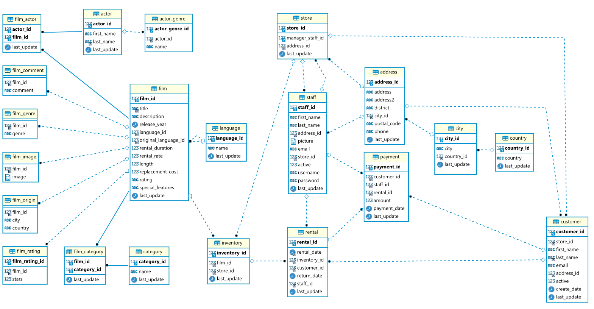

The lis-commons-test-db library provides support for setting up test databases
and also includes the sakila sample databases that is ready to use.

# Maven Dependency

Browse all versions under [mvnrepository.com](https://mvnrepository.com/artifact/com.link-intersystems.commons/lis-commons-test-db).

    <dependency>
        <groupId>com.link-intersystems.commons</groupId>
        <artifactId>lis-commons-test-db</artifactId>
        <scope>test</scope>
        <version>1.4.4</version>
    </dependency>

# Sakila Sample Database

The sakila sample database is provided by oracle's mysql database
and published under the [BSD license](https://en.wikipedia.org/wiki/BSD_licenses).

The sakila sample database is provided as the JUnit extension `SakilaTestDBExtension`.
This extension is a `ParameterResolver` so that you can inject either a jdbc `Connection`
or a `H2Database` into your tests by simply specifying them as parameters to a test method.

    @ExtendWith(SakilaTestDBExtension.class)
    class DatabaseTest {
    
        // Inject in before methods
    
        @BeforeEach
        void setUp(Connection connection) {
        }
    
        // or inject in test methods.
    
        @Test
        void selectSakilaDatabase(Connection connection) {
            try (Statement stmt = connection.createStatement()) {
                if (stmt.execute("select * from actor where actor_id = 1")) {
                    ResultSet rs = stmt.getResultSet();
    
                    assertTrue(rs.next(), "result set should not be empty");
    
                    assertEquals(1L, rs.getLong("actor_id"), "actor_id");
                    assertEquals("PENELOPE", rs.getString("first_name"), "first_name");
                    assertEquals("GUINESS", rs.getString("last_name"), "last_name");
                }
            }
        }
    }

> You don't need to close or reset the `Connection` the `SakilaTestDBExtension` will provide you a clean
> database for every test method and closes the Connection after all tests were executed.

## Sakila Database Data

Take a look at [sakila-db.xml](https://raw.githubusercontent.com/link-intersystems/lis-commons/master/lis-commons-test-db/src/main/resources/com/link_intersystems/test/db/sakila/sakila-db.xml)
or [sakila-db.sql](https://raw.githubusercontent.com/link-intersystems/lis-commons/master/lis-commons-test-db/src/main/resources/com/link_intersystems/test/db/sakila/sakila-db.sql)
for details about the data.

If you need a browsable database you can run this docker image:

     docker run -d -p 3306:3306 --name sakila restsql/mysql-sakila

or if you only need it temporary

     docker run --rm -p 3306:3306 restsql/mysql-sakila